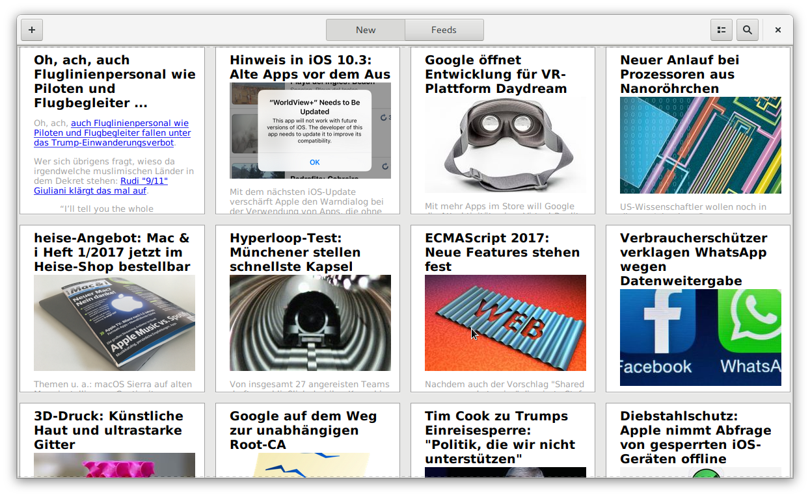
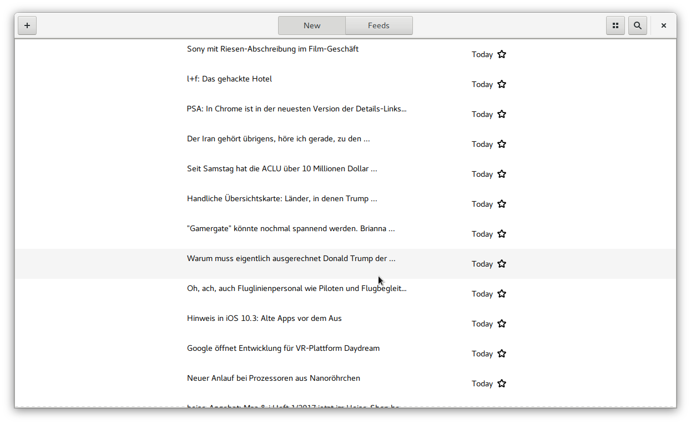

Gnome News V2
=============

Gnome News is currently unmaintained. I would love to reactivate it but i dont like python as
programming language for a project like that. So i try here to recreate gnome news in vala
with all special features we recently got: Composite Widgets, Gresource files, DBus Integration,
Tracker RSS Miner etc.

Stay tuned!
